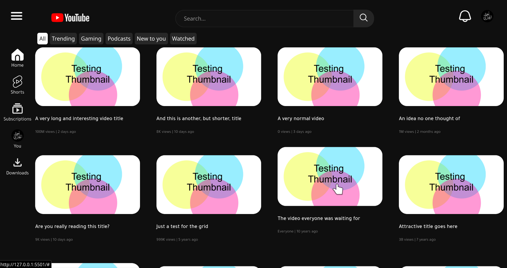

# YouTube UI Clone (Archived)

> **Note:** This project has been archived. It was a hands-on practice project built during my early learning journey to master CSS fundamentals and web UI layouts. It is no longer under active development.

## About the Project
A simple clone of the YouTube user interface. The primary goals of this learning project were to practice:
* Using `Flexbox` and `Grid` for layout distribution and alignment.
* Applying CSS fundamentals, including colors, spacing, and typography.
* Understanding the structure and building blocks of basic web pages.

##  Preview


## How to run?
You can clone the repo using:
```bash
git clone https://github.com/al-jbri/youtube-interface-clone/
```
and run the `index.html` file

thanks :)
